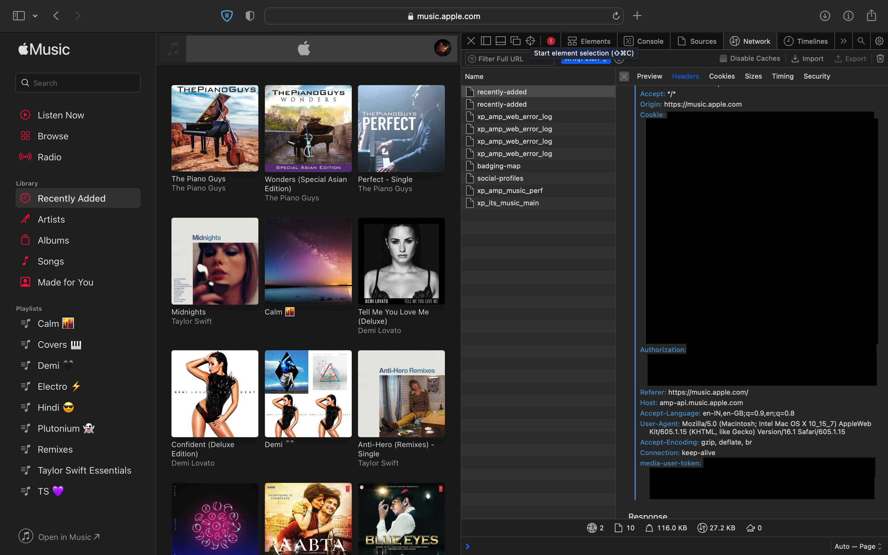

[](https://forthebadge.com)

[](https://forthebadge.com)
[](https://forthebadge.com)
<div id="top"></div>
<!-- PROJECT LOGO -->
<br />
<div align="center">
  
  <h2 align="center">Apple Music Card</h3>

<p align="center">
    A card to show random album from your recents in Apple Music Library
</p>
<br>
</div>


<!-- TABLE OF CONTENTS -->
<details>
  <summary>Table of Contents</summary>
  <ol>
    <li>
      <a href="#about-the-project">About The Project</a>
      <ul>
        <li><a href="#built-with">Built With</a></li>
      </ul>
    </li>
    <li>
      <a href="#getting-started">Getting Started</a>
      <ul>
        <li><a href="#setting-up">Setting Up</a></li>
      </ul>
    </li>
    <li><a href="#contributing">Contributing</a></li>
    <li><a href="#license">License</a></li>
  </ol>
</details>

<br>

<!-- ABOUT THE PROJECT -->
## About The Project

I came across multiple projects which displayed your recently songs on your GitHub readme but found none for Apple Music. Since the Apple Music API kit is paid, I found an easy hack to get the recently added albums to Apple Music library **for free**.

If you want to use this project, just follow the steps below


<p align="right">(<a href="#top">back to top</a>)</p>


<!-- GETTING STARTED -->
## Getting Started

You will need two things to set-up this project for your own GitHub readme:

- [ ] Apple Music Account
- [ ] Vercel Account
- [ ] A web brower (with dev tools)


### Setting Up

1. [Fork the repo](https://github.com/radioactive11/apple-music-readme/fork)
   
2. Login to Apple Music in a broswer
   
3. Open Dev Tools and switch to the `Network Tab`. Select Fetch/XHR filter 

4. Click on the Recently Added section in the side navbar

5. From the request headers, copy and keep the values of these keys for future use:

* `Cookie`
* `Authorization`
* `media-user-token`



6. Head to [https://vercel.com](vercel.com) and Login/Signup

7. Goto `Add New` -> `Project` -> `Continue with GitHub`

8. Select the forked repo from the list of repositories

9. In the configure project section, add the Environment Variable as follows with values from step 5

* Cookie: `Cookie`
* AUTH_TOKEN: `Authorization`
* MEDIA_USER_TOKEN: `MEDIA_USER_TOKEN`

10. Click deploy 🚀

11. In your GitHub readme, add the card using the following tag:
```html

```

**Note: DO NOT FORGET TO ADD THE '/?' IN THE END OF THE URL**

<p align="right">(<a href="#top">back to top</a>)</p>

<!-- CONTRIBUTING -->
## Contributing

Contributions are what make the open source community such an amazing place to learn, inspire, and create. Any contributions you make are **greatly appreciated**.

If you have a suggestion that would make this better, please fork the repo and create a pull request. You can also simply open an issue with the tag "enhancement".
Don't forget to give the project a star! Thanks again!

1. Fork the Project
2. Create your Feature Branch (`git checkout -b feature/AmazingFeature`)
3. Commit your Changes (`git commit -m 'Add some AmazingFeature'`)
4. Push to the Branch (`git push origin feature/AmazingFeature`)
5. Open a Pull Request

<p align="right">(<a href="#top">back to top</a>)</p>


<!-- LICENSE -->
## License

Distributed under the MIT License. See `LICENSE.txt` for more information.

<p align="right">(<a href="#top">back to top</a>)</p>
